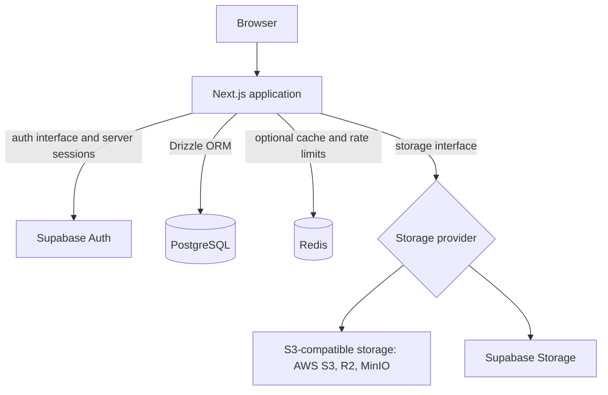

# Clubedge Starter

[](https://github.com/Clubedge/clubedge-starter/actions/workflows/ci.yml)
[](LICENSE)

Clubedge Starter is a production-oriented, modular Next.js application foundation. It brings together a pnpm monorepo, shared shadcn/ui components, PostgreSQL access through Drizzle, Supabase Auth, optional Redis and storage adapters, and a working example dashboard. It provides engineering conventions and a reference implementation; review its security and deployment choices for your application before production use.

This is a starter, not a hosted service or a one-command app generator. Fork it or use it as a reference, then adapt the app and provider configuration to your project. Contributions and bug reports are welcome; see [CONTRIBUTING.md](CONTRIBUTING.md). Repository maintainers can use [PUBLISHING.md](PUBLISHING.md) for the GitHub launch checklist.

## Features

- Next.js App Router, React, TypeScript, Tailwind CSS 4, and shadcn/ui using Base UI primitives.
- pnpm workspaces and Turborepo, with the web app in `apps/web` and reusable UI source in `packages/ui`.
- Drizzle ORM and PostgreSQL schema, migrations, and seed commands.
- Supabase Auth using cookie based server clients from `@supabase/ssr`.
- S3 compatible storage (including Cloudflare R2) and Supabase Storage adapters.
- Optional Redis cache and fixed-window rate limiter using a standard Redis URL.
- Zod environment validation, security headers, structured errors, and `/api/health`.
- Docker support, GitHub Actions CI, Vitest, Playwright, ESLint, and Prettier.

## Stack and provider choices

| Capability              | Included choice                                      | Other supported options                                               |
| ----------------------- | ---------------------------------------------------- | --------------------------------------------------------------------- |
| Web app                 | Next.js App Router, React, TypeScript                | —                                                                     |
| UI                      | Tailwind CSS 4, shadcn/ui, and Base UI               | Add or replace components in your app or shared UI package.           |
| Database                | PostgreSQL through Drizzle ORM                       | Any reachable PostgreSQL provider; Supabase PostgreSQL is documented. |
| Authentication          | Supabase Auth with `@supabase/ssr`                   | No alternate auth adapter is currently included.                      |
| Cache and rate limiting | Optional Redis protocol client                       | Upstash, self-hosted Redis, or a compatible Redis service.            |
| Object storage          | S3-compatible adapter or Supabase Storage            | AWS S3, Cloudflare R2, and other S3-compatible services.              |
| Local runtime           | Docker and Next.js standalone output                 | Run directly with Node.js during development.                         |
| Verification            | Vitest, Playwright, ESLint, Prettier, GitHub Actions | —                                                                     |

## Architecture



Drizzle manages application data in PostgreSQL. Supabase Auth manages identity and sessions separately; it is not accessed through Drizzle. The PostgreSQL database may be Supabase PostgreSQL or another PostgreSQL provider.

### Architecture principles

- **PostgreSQL is the source of truth for application data.** Drizzle centralizes application schema, queries, and migrations.
- **Authentication stays separate from application data.** Supabase Auth owns credentials and sessions; application tables are managed by Drizzle.
- **Infrastructure dependencies stay optional where practical.** Redis is only needed for distributed cache and rate limiting. Without Redis, the rate limiter falls back to a per-process memory window, which is suitable for a single server instance only.
- **Storage has a provider boundary.** Application code can use the storage interface with S3-compatible services or Supabase Storage; authorization and upload validation remain the caller's responsibility.
- **Keep the baseline focused.** Additional providers, queues, and generator tooling should be added when a real use case calls for them.

## Quick start

### Requirements

- Node.js 22.12 or newer (Node.js 22 LTS recommended).
- pnpm 10.9.0. The repository pins its package manager version using Corepack.
- PostgreSQL when using database features. A Supabase project can provide both PostgreSQL and Auth.

### Install and run

```sh
corepack enable
pnpm install
```

Copy the example environment file to the web app's local environment file.

PowerShell:

```powershell
Copy-Item .env.example apps/web/.env.local
```

macOS/Linux:

```sh
cp .env.example apps/web/.env.local
```

Set `DATABASE_URL` in `apps/web/.env.local`. Supabase Auth is optional for exploring the UI; set `NEXT_PUBLIC_SUPABASE_URL` and `NEXT_PUBLIC_SUPABASE_PUBLISHABLE_KEY` to enable it. See [SETUP.md](SETUP.md) for provider setup and optional integrations. Then start the app:

```sh
pnpm dev
```

Open <http://localhost:3000> for the landing page, <http://localhost:3000/dashboard> for the starter dashboard, or <http://localhost:3000/api/health> for the liveness endpoint. The pages render without connecting to providers. Database, authentication, storage, and Redis operations require their respective configuration.

## Common commands

Run these from the repository root:

| Command             | Purpose                                        |
| ------------------- | ---------------------------------------------- |
| `pnpm dev`          | Start the web app in development mode.         |
| `pnpm build`        | Create a production build.                     |
| `pnpm start`        | Start the standalone production build.         |
| `pnpm lint`         | Run ESLint.                                    |
| `pnpm typecheck`    | Typecheck the workspaces.                      |
| `pnpm test`         | Run Vitest.                                    |
| `pnpm test:e2e`     | Run Playwright browser checks.                 |
| `pnpm format`       | Format supported repository files.             |
| `pnpm format:check` | Check formatting without writing files.        |
| `pnpm db:generate`  | Generate Drizzle migrations from the schema.   |
| `pnpm db:migrate`   | Apply checked-in Drizzle migrations.           |
| `pnpm db:push`      | Push schema directly (local development only). |
| `pnpm db:studio`    | Open Drizzle Studio.                           |
| `pnpm db:check`     | Check migration consistency.                   |
| `pnpm db:seed`      | Seed the configured database.                  |

Playwright's first run may require installing Chromium with `pnpm exec playwright install chromium`. CI runs the browser checks automatically.

## Repository structure

```text
apps/web/       Next.js app, API routes, database schema, and app-specific code
packages/ui/    Shared shadcn/ui components, utilities, and global theme styles
.github/        CI workflow, issue forms, and pull request template
SETUP.md        Detailed local and provider setup
CONTRIBUTING.md Contribution workflow and review expectations
SECURITY.md     Vulnerability reporting guidance
```

The project name, description, service identifier, and documentation links live in `apps/web/src/config/site.json`. Edit that file to rename the app; `create-clubedge-app` writes it for generated projects.

## Shared UI components

The shared component package is `@clubedge/ui`. It uses the shadcn `base-nova` style, which generates components backed by `@base-ui/react` rather than Radix UI. The landing page and dashboard demonstrate the shared sidebar, breadcrumbs, theme switch, buttons, cards, badges, separators, inputs, labels, and tables. The light/dark theme preference is stored in the browser; dark mode uses a `#151515` page background and blue `#2563eb` primary color.

Add a component from the repository root using the web app's config:

```sh
pnpm dlx shadcn@latest add badge -c apps/web
```

Shared components are generated under `packages/ui/src/components` and can be imported from `@clubedge/ui/components/<component>`. The two `components.json` files intentionally share the `base-nova` style, neutral color base, Lucide icons, Tailwind v4 stylesheet, and RTL-aware generation setting. The app currently renders English in LTR; set the root document's `lang` and `dir` for the locale used by your application. Put app-only components in `apps/web/src/components`.

## Contributing

Please read [CONTRIBUTING.md](CONTRIBUTING.md) before opening an issue or pull request. For local changes, run the relevant checks before submitting. You can report vulnerabilities privately using the process in [SECURITY.md](SECURITY.md).

## License

Copyright © 2026 Clubedge Digital Systems. This project is licensed under the Apache License, Version 2.0. See [LICENSE](LICENSE) and [NOTICE](NOTICE).
